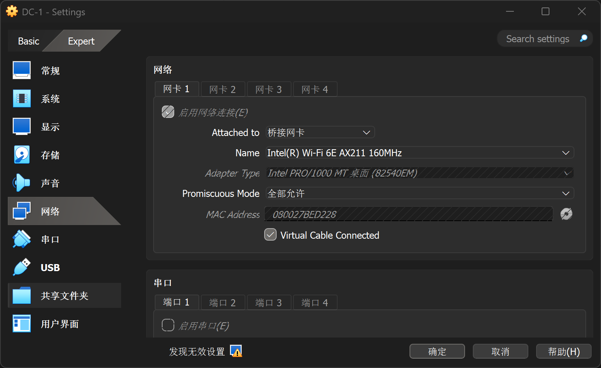
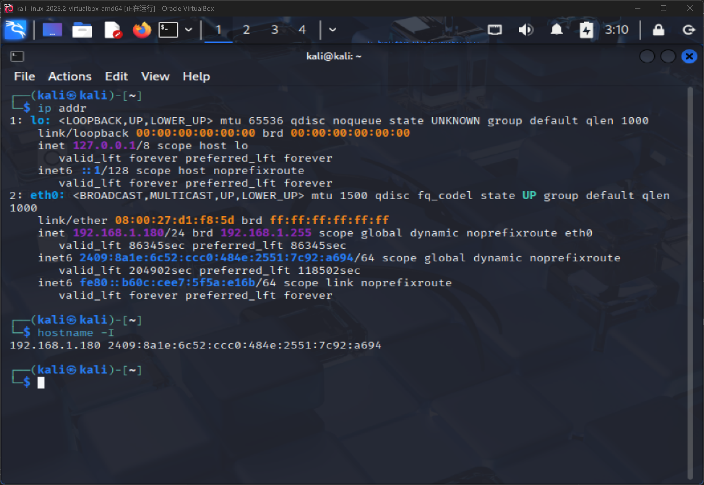

#### 导入
在 VirtualBox 中导入.ova靶机文件后，前往**设置-网络**选项
一定要确保Kali虚拟机和靶机均使用**桥接网卡**！
在Promiscuous Mode（混杂模式）中选择“全部允许”

配置完成后启动靶机和Kali虚拟机，在虚拟机中输入
```bash
ip addr
hostname -I
```

图中的`192.168.1.180`就是虚拟机的IP，子网掩码为`/24`。

#### 移除
在`C:\Users\10557\VirtualBox VMs\`或`D:\VMs\`内确保删除所有的文件。